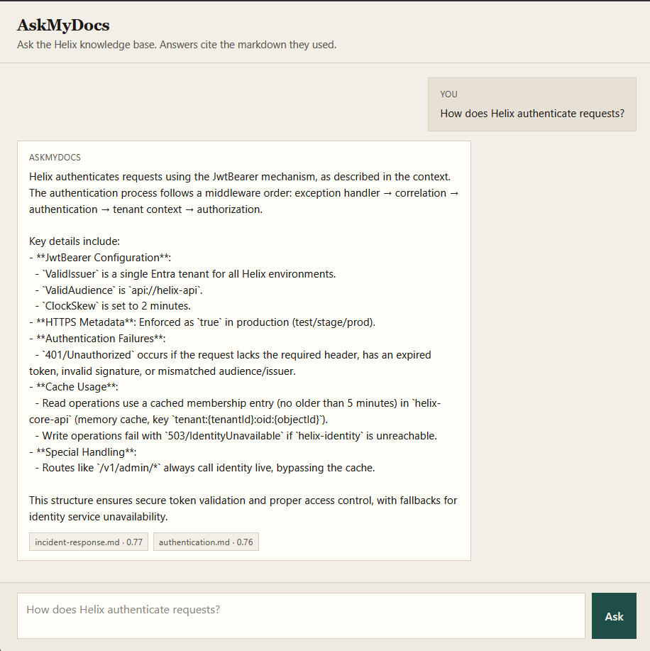
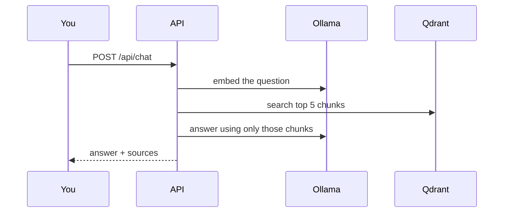

# AskMyDocs

Ask a folder of markdown. The API chunks it, embeds it with Ollama, stores the vectors in Qdrant, and answers with the files it used.

The chat is a static page served by the API — no extra frontend. Sample docs describe a fake platform called Helix.

<p align="center">
  
</p>

## How it works



On startup, and again via `POST /api/documents/index`, every `.md` file in `Knowledgebase/` is split into overlapping paragraph chunks (~500 characters), embedded, and upserted into Qdrant (`knowledge_base`). Point IDs are a hash of source + content, so re-indexing does not duplicate. If the retrieved chunks do not contain the answer, the model is told to say so instead of guessing.

## Run it

You need Docker. First boot is slow — that is Ollama pulling `qwen3:1.7b` and `nomic-embed-text`, not the API hanging.

```bash
cd AskMyDocs.API
docker compose up --build
```

When `askmydocs-api` is up, open [http://localhost:8080](http://localhost:8080).

```bash
curl -s http://localhost:8080/api/chat \
  -H "Content-Type: application/json" \
  -d "{\"message\":\"How does Helix authenticate requests?\"}"
```

On PowerShell, use `curl.exe` so you do not hit the `Invoke-WebRequest` alias. Empty `message` is **400**. Ollama down or timed out is **503**. `GET /health` should return `Healthy`.

```json
{
  "answer": "...",
  "sources": [{ "document": "authentication.md", "score": 0.81 }]
}
```

`score` is Qdrant similarity (best chunk if the same file showed up more than once).

After you edit markdown:

```bash
curl -s -X POST http://localhost:8080/api/documents/index \
  -H "X-Api-Key: dev-index-key"
```

Wrong or missing key is **401**. The key is `IndexApiKey` in config (default `dev-index-key`). Change it if this is not just local.

### API on the host

If Ollama and Qdrant are already running locally (`localhost:11434` and gRPC `6334`), with those two models pulled:

```bash
dotnet run --project AskMyDocs.API
```

Chat is at [http://localhost:5058](http://localhost:5058). `appsettings.json` already points at localhost; compose overrides those URLs in Docker.

## Tests

```bash
dotnet test
```

CI on `master` runs the same. Tests do not start Docker, Ollama, or Qdrant.

.NET 10, Ollama, Qdrant. MIT license.
