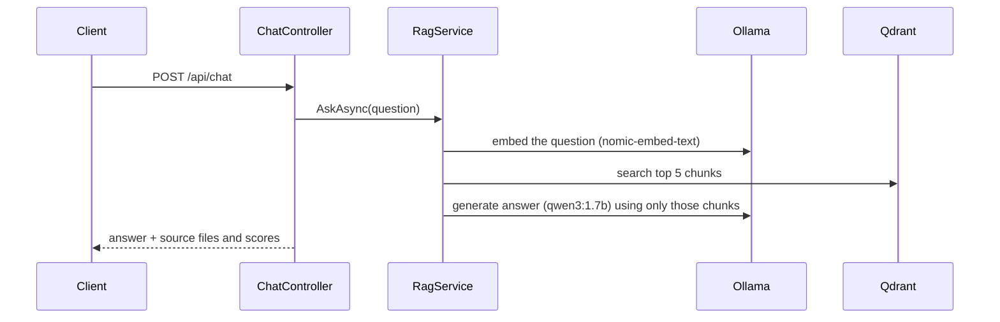
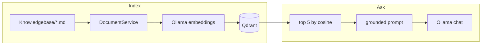

# AskMyDocs

ASP.NET Core API that answers questions from a folder of markdown docs.

There is no chat UI. You drop `.md` files in `Knowledgebase/`, the API chunks and embeds them, Qdrant stores the vectors, and `POST /api/chat` returns an answer plus the files it used. The sample corpus is a fake internal platform called Helix, so the model has something concrete to talk about.

## How a question is answered



Indexing is a separate path. On startup a hosted service reads every markdown file, splits it into overlapping paragraph chunks (~500 characters), embeds each chunk, and upserts into a Qdrant collection named `knowledge_base`. Point IDs are a hash of `source + content`, so running index again does not create duplicates.



If the retrieved context does not contain the answer, the prompt tells the model to say it does not have enough information rather than invent one.

## What's in the repo

```
AskMyDocs.slnx
AskMyDocs.API/                 ASP.NET Core 10 Web API
  Controllers/                 POST /api/chat, POST /api/documents/index
  Services/                    chunking, embeddings, Qdrant, RAG, Ollama
  Knowledgebase/               sample Helix docs (architecture, auth, security, ...)
  docker-compose.yml           API + Ollama + Qdrant
AskMyDocs.Tests/               xUnit tests for chunking, RAG, and controllers
```

The API talks to Ollama over HTTP (`api/embeddings`, `api/generate`) and to Qdrant over gRPC on port 6334. Vectors are 768-dimensional, cosine distance, which matches `nomic-embed-text`.

## Running it

You need Docker, and a machine that can pull two Ollama models. First boot is slow. That is the model download, not the API hanging.

```bash
cd AskMyDocs.API
docker compose up --build
```

Wait until `askmydocs-api` is up. `ollama-init` has to finish pulling `qwen3:1.7b` and `nomic-embed-text` before the API starts. After that the API indexes the knowledge base on its own.

The API listens on [http://localhost:8080](http://localhost:8080).

```bash
curl -s http://localhost:8080/api/chat \
  -H "Content-Type: application/json" \
  -d "{\"message\":\"How does Helix authenticate requests?\"}"
```

On Windows PowerShell, use `curl.exe` so you do not hit the `Invoke-WebRequest` alias.

You should get something like:

```json
{
  "answer": "...",
  "sources": [
    { "document": "authentication.md", "score": 0.81 }
  ]
}
```

`score` is the Qdrant similarity for that file (highest chunk if the same file showed up more than once).

To re-index after you edit markdown:

```bash
curl -s -X POST http://localhost:8080/api/documents/index
```

In Development, OpenAPI JSON is at `/openapi/v1.json`. There is no Swagger UI in this repo.

### Running the API on the host instead

If Ollama and Qdrant are already running locally (`localhost:11434` and gRPC `6334`), with those two models pulled:

```bash
dotnet run --project AskMyDocs.API
```

That uses `http://localhost:5058` (see `launchSettings.json`). `appsettings.json` already points at localhost; compose overrides those URLs when you run in Docker.

## Tests

```bash
dotnet test
```

These are unit tests. They do not start Docker, Ollama, or Qdrant.

| Area | What they actually check |
| --- | --- |
| `DocumentService` | paragraph splitting, overlap, source filenames, empty files, ignoring non-markdown |
| `RagService` | embed → search top 5 → prompt; source grouping; empty retrieval; Ollama failures |
| Controllers | request is forwarded, index counts distinct files vs chunks, failures are not swallowed |

The HTTP clients and the Qdrant adapter are left out on purpose. Faking `HttpClient` there would not prove much.

## Stack

- .NET 10 / ASP.NET Core
- Ollama (`qwen3:1.7b`, `nomic-embed-text`)
- Qdrant
- xUnit

Config lives under `Ollama` and `Qdrant` in `appsettings.json`. Compose sets `Ollama__BaseUrl`, `Qdrant__Host`, and `Qdrant__Port` so the container talks to the other services by name.
